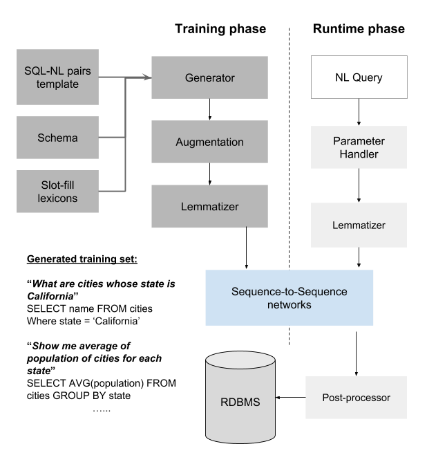
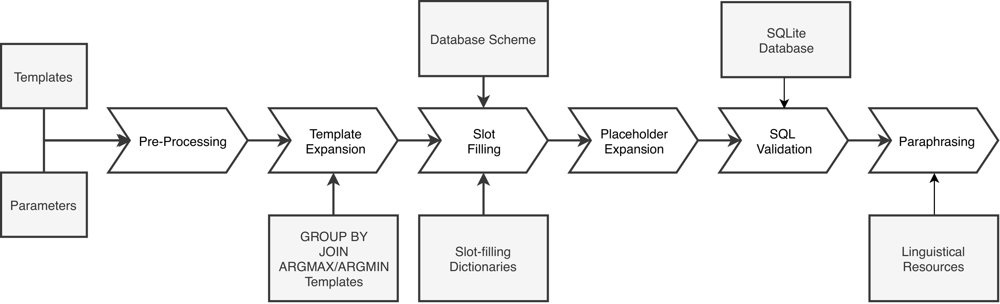

# DBPal NL-SQL Data Generation Pipeline

This pipeline is used to generate synthetic training data pairs for natural language to SQL translation, based on a data base scheme.

Synthetic data generation is an integral part of the end-to-end approach by DBPal:

You can see an overview of the pipeline modules below:

This directory contains instructions on how to  and  the pipeline, as well as information on the  and  used to build it.
